```mermaid
sequenceDiagram
actor U as User
participant UI
participant CB as Code Behind
participant DB as Database
U->>UI:ввод авторизационных данных
UI->>CB:передача данных
CB->>DB:поиск пользователя
DB-->>CB:результат поиска
CB->>CB:валидация
CB->>UI:сообщение об успешности
```

# Тема
Информационая система
Описание предметной области
---
Данный проект предназначен для автоматизации покупок у клиентов магазина парфюмерии. 
В проекте присутствует база данных состоящая из следующих таблиц:
 - TProducts - таблица, хрянящаяя в себе данные о продуктах;
 - TProductCategories - таблица, хрянящаяя в себе данные о категориях продуктов;
 - TPickUpPoints - таблица, хрянящаяя в себе данные о пунктах выдачи;
 - TUsers - таблица, хрянящаяя в себе данные о пользователях;
 - TManufacturers - таблица, хрянящаяя в себе данные о производителях;
 - TSuppliers - таблица, хрянящаяя в себе данные о поставщиках;
 - TCarts - таблица, хрянящаяя в себе данные о корзинах пользователей;
 - TOrders - таблица, хрянящаяя в себе данные о заказах пользователей;
 - TRoles - таблица, хрянящаяя в себе данные о ролях пользователях;
 - TUnitsOfMeasurement - таблица, хрянящаяя в себе данные о единицах измерения ;

Бизнес домен
---
Продажа парфюмерии

Автор
---
Монашов Николай Егорович студент группы ИП 20-3


## Схема базы данных


---
Диаграмма последовательности для прецендента авторизация
---



---
Скрипт на импорт в БД
---
```sh
USE [FragrantWorld]
GO
SET IDENTITY_INSERT [dbo].[Manufacturers] ON 
GO
INSERT [dbo].[Manufacturers] ([Id], [Name]) VALUES (5, N'Dilis Parfum')
GO
INSERT [dbo].[Manufacturers] ([Id], [Name]) VALUES (9, N'DOLCE & GABBANA')
GO
INSERT [dbo].[Manufacturers] ([Id], [Name]) VALUES (1, N'Dragon')
GO
INSERT [dbo].[Manufacturers] ([Id], [Name]) VALUES (8, N'HUGO BOSS')
GO
INSERT [dbo].[Manufacturers] ([Id], [Name]) VALUES (10, N'LACOSTE')
GO
INSERT [dbo].[Manufacturers] ([Id], [Name]) VALUES (3, N'Parfums Constantine')
GO
INSERT [dbo].[Manufacturers] ([Id], [Name]) VALUES (2, N'Paris Line')
GO
INSERT [dbo].[Manufacturers] ([Id], [Name]) VALUES (4, N'Today Parfum')
GO
INSERT [dbo].[Manufacturers] ([Id], [Name]) VALUES (6, N'TRUSSARDI')
GO
INSERT [dbo].[Manufacturers] ([Id], [Name]) VALUES (7, N'Yves de Sistelle')
GO
SET IDENTITY_INSERT [dbo].[Manufacturers] OFF
GO
SET IDENTITY_INSERT [dbo].[ProductCategories] ON 
GO
INSERT [dbo].[ProductCategories] ([Id], [Name]) VALUES (2, N'Женский парфюм')
GO
INSERT [dbo].[ProductCategories] ([Id], [Name]) VALUES (1, N'Мужской парфюм')
GO
SET IDENTITY_INSERT [dbo].[ProductCategories] OFF
GO
SET IDENTITY_INSERT [dbo].[Suppliers] ON 
GO
INSERT [dbo].[Suppliers] ([Id], [Name]) VALUES (1, N'Летуаль')
GO
INSERT [dbo].[Suppliers] ([Id], [Name]) VALUES (2, N'Рив Гош')
GO
SET IDENTITY_INSERT [dbo].[Suppliers] OFF
GO
SET IDENTITY_INSERT [dbo].[UnitsOfMeasurement] ON 
GO
INSERT [dbo].[UnitsOfMeasurement] ([Id], [Name]) VALUES (1, N'шт.')
GO
SET IDENTITY_INSERT [dbo].[UnitsOfMeasurement] OFF
GO
INSERT [dbo].[Products] ([ArticleNumber], [Name], [Description], [UnitOfMeasurementId], [Price], [CurrentDiscount], [MaxDiscount], [ManufacturerId], [SupplierId], [CategoryId], [StorageAmount], [ImageURL]) VALUES (N'A436H7', N'Туалетная вода', N'Туалетная вода Dilis Parfum Aqua Cool, 100 мл', 1, CAST(1000.00 AS Decimal(18, 2)), 4, 15, 5, 1, 1, 12, N'')
GO
INSERT [dbo].[Products] ([ArticleNumber], [Name], [Description], [UnitOfMeasurementId], [Price], [CurrentDiscount], [MaxDiscount], [ManufacturerId], [SupplierId], [CategoryId], [StorageAmount], [ImageURL]) VALUES (N'C323R4', N'Парфюмерная вода', N'Парфюмерная вода TRUSSARDI Donna Trussardi (2011), 50 мл', 1, CAST(4100.00 AS Decimal(18, 2)), 4, 25, 6, 1, 1, 8, N'')
GO
INSERT [dbo].[Products] ([ArticleNumber], [Name], [Description], [UnitOfMeasurementId], [Price], [CurrentDiscount], [MaxDiscount], [ManufacturerId], [SupplierId], [CategoryId], [StorageAmount], [ImageURL]) VALUES (N'D344Y7', N'Парфюмерная вода', N'Парфюмерная вода Today Parfum Prestige №6 Eclat, 17 мл', 1, CAST(223.00 AS Decimal(18, 2)), 5, 10, 4, 1, 2, 16, N'D344Y7.jpg')
GO
INSERT [dbo].[Products] ([ArticleNumber], [Name], [Description], [UnitOfMeasurementId], [Price], [CurrentDiscount], [MaxDiscount], [ManufacturerId], [SupplierId], [CategoryId], [StorageAmount], [ImageURL]) VALUES (N'D378D3', N'Туалетная вода', N'Духи Dilis Parfum Classic Collection №18, 30 мл', 1, CAST(1500.00 AS Decimal(18, 2)), 3, 10, 5, 1, 2, 16, N'D378D3.jpg')
GO
INSERT [dbo].[Products] ([ArticleNumber], [Name], [Description], [UnitOfMeasurementId], [Price], [CurrentDiscount], [MaxDiscount], [ManufacturerId], [SupplierId], [CategoryId], [StorageAmount], [ImageURL]) VALUES (N'D526R4', N'Парфюмерная вода', N'Парфюмерная вода DOLCE & GABBANA Dolce&Gabbana pour', 1, CAST(3600.00 AS Decimal(18, 2)), 3, 10, 9, 1, 2, 6, N'')
GO
INSERT [dbo].[Products] ([ArticleNumber], [Name], [Description], [UnitOfMeasurementId], [Price], [CurrentDiscount], [MaxDiscount], [ManufacturerId], [SupplierId], [CategoryId], [StorageAmount], [ImageURL]) VALUES (N'D634D4', N'Туалетная вода', N'Туалетная вода Paris Line Parfums Dollar Diamond, 100 мл', 1, CAST(367.00 AS Decimal(18, 2)), 2, 15, 2, 2, 1, 14, N'')
GO
INSERT [dbo].[Products] ([ArticleNumber], [Name], [Description], [UnitOfMeasurementId], [Price], [CurrentDiscount], [MaxDiscount], [ManufacturerId], [SupplierId], [CategoryId], [StorageAmount], [ImageURL]) VALUES (N'E245R5', N'Туалетная вода', N'Туалетная вода Dilis Parfum Mila, 100 мл', 1, CAST(1000.00 AS Decimal(18, 2)), 5, 15, 5, 2, 2, 2, N'E245R5.jpg')
GO
INSERT [dbo].[Products] ([ArticleNumber], [Name], [Description], [UnitOfMeasurementId], [Price], [CurrentDiscount], [MaxDiscount], [ManufacturerId], [SupplierId], [CategoryId], [StorageAmount], [ImageURL]) VALUES (N'E479G6', N'Туалетная вода', N'Туалетная вода HUGO BOSS Boss Bottled, 100 мл', 1, CAST(6100.00 AS Decimal(18, 2)), 5, 25, 8, 2, 1, 3, N'')
GO
INSERT [dbo].[Products] ([ArticleNumber], [Name], [Description], [UnitOfMeasurementId], [Price], [CurrentDiscount], [MaxDiscount], [ManufacturerId], [SupplierId], [CategoryId], [StorageAmount], [ImageURL]) VALUES (N'E530Y6', N'Парфюмерная вода', N'Парфюмерная вода Parfums Constantine Mademoiselle 5, 50 мл', 1, CAST(519.00 AS Decimal(18, 2)), 3, 15, 3, 1, 2, 9, N'E530Y6.jpg')
GO
INSERT [dbo].[Products] ([ArticleNumber], [Name], [Description], [UnitOfMeasurementId], [Price], [CurrentDiscount], [MaxDiscount], [ManufacturerId], [SupplierId], [CategoryId], [StorageAmount], [ImageURL]) VALUES (N'E573G6', N'Духи', N'Духи Dilis Parfum Classic Collection №34, 30 мл', 1, CAST(1087.00 AS Decimal(18, 2)), 5, 15, 5, 2, 2, 13, N'')
GO
INSERT [dbo].[Products] ([ArticleNumber], [Name], [Description], [UnitOfMeasurementId], [Price], [CurrentDiscount], [MaxDiscount], [ManufacturerId], [SupplierId], [CategoryId], [StorageAmount], [ImageURL]) VALUES (N'F344S4', N'Туалетная вода', N'Туалетная вода Today Parfum Cola Cherry, 50 мл', 1, CAST(546.00 AS Decimal(18, 2)), 2, 5, 4, 2, 2, 9, N'')
GO
INSERT [dbo].[Products] ([ArticleNumber], [Name], [Description], [UnitOfMeasurementId], [Price], [CurrentDiscount], [MaxDiscount], [ManufacturerId], [SupplierId], [CategoryId], [StorageAmount], [ImageURL]) VALUES (N'F346G5', N'Туалетная вода', N'Туалетная вода Today Parfum G-Club Egoist, 100 мл', 1, CAST(450.00 AS Decimal(18, 2)), 3, 5, 4, 2, 2, 18, N'F346G5.jpg')
GO
INSERT [dbo].[Products] ([ArticleNumber], [Name], [Description], [UnitOfMeasurementId], [Price], [CurrentDiscount], [MaxDiscount], [ManufacturerId], [SupplierId], [CategoryId], [StorageAmount], [ImageURL]) VALUES (N'F893T5', N'Туалетная вода', N'Туалетная вода Paris Line Parfums Cosa Nostra Platinum, 100 мл', 1, CAST(327.00 AS Decimal(18, 2)), 2, 15, 2, 2, 2, 14, N'F893T5.jpg')
GO
INSERT [dbo].[Products] ([ArticleNumber], [Name], [Description], [UnitOfMeasurementId], [Price], [CurrentDiscount], [MaxDiscount], [ManufacturerId], [SupplierId], [CategoryId], [StorageAmount], [ImageURL]) VALUES (N'G532R5', N'Парфюмерная вода', N'Парфюмерная вода Parfums Constantine New York Perfume Six, 50 мл', 1, CAST(640.00 AS Decimal(18, 2)), 3, 10, 3, 1, 1, 16, N'')
GO
INSERT [dbo].[Products] ([ArticleNumber], [Name], [Description], [UnitOfMeasurementId], [Price], [CurrentDiscount], [MaxDiscount], [ManufacturerId], [SupplierId], [CategoryId], [StorageAmount], [ImageURL]) VALUES (N'G832G6', N'Туалетная вода', N'Туалетная вода Paris Line Parfums Vodka Extreme, 100 мл', 1, CAST(368.00 AS Decimal(18, 2)), 4, 10, 2, 2, 2, 7, N'G832G6.jpg')
GO
INSERT [dbo].[Products] ([ArticleNumber], [Name], [Description], [UnitOfMeasurementId], [Price], [CurrentDiscount], [MaxDiscount], [ManufacturerId], [SupplierId], [CategoryId], [StorageAmount], [ImageURL]) VALUES (N'H647R5', N'Туалетная вода', N'Туалетная вода Parfums Constantine Gentleman №3, 100 мл', 1, CAST(555.00 AS Decimal(18, 2)), 4, 10, 3, 2, 2, 6, N'')
GO
INSERT [dbo].[Products] ([ArticleNumber], [Name], [Description], [UnitOfMeasurementId], [Price], [CurrentDiscount], [MaxDiscount], [ManufacturerId], [SupplierId], [CategoryId], [StorageAmount], [ImageURL]) VALUES (N'H732R5', N'Туалетная вода', N'Туалетная вода Paris Line Parfums Cosa Nostra, 100 мл', 1, CAST(500.00 AS Decimal(18, 2)), 5, 15, 2, 2, 2, 7, N'')
GO
INSERT [dbo].[Products] ([ArticleNumber], [Name], [Description], [UnitOfMeasurementId], [Price], [CurrentDiscount], [MaxDiscount], [ManufacturerId], [SupplierId], [CategoryId], [StorageAmount], [ImageURL]) VALUES (N'J432E4', N'Туалетная вода', N'Туалетная вода Paris Line Parfums Dollar, 100 мл', 1, CAST(341.00 AS Decimal(18, 2)), 2, 5, 2, 2, 2, 4, N'J432E4.jpg')
GO
INSERT [dbo].[Products] ([ArticleNumber], [Name], [Description], [UnitOfMeasurementId], [Price], [CurrentDiscount], [MaxDiscount], [ManufacturerId], [SupplierId], [CategoryId], [StorageAmount], [ImageURL]) VALUES (N'K535G6', N'Парфюмерная вода', N'Парфюмерная вода Yves de Sistelle Incidence pour Femme, 65 мл', 1, CAST(1200.00 AS Decimal(18, 2)), 2, 15, 7, 2, 2, 5, N'')
GO
INSERT [dbo].[Products] ([ArticleNumber], [Name], [Description], [UnitOfMeasurementId], [Price], [CurrentDiscount], [MaxDiscount], [ManufacturerId], [SupplierId], [CategoryId], [StorageAmount], [ImageURL]) VALUES (N'K742T5', N'Туалетная вода', N'Туалетная вода Dilis Parfum Cool&Grey, 100 мл', 1, CAST(900.00 AS Decimal(18, 2)), 4, 15, 5, 1, 1, 6, N'')
GO
INSERT [dbo].[Products] ([ArticleNumber], [Name], [Description], [UnitOfMeasurementId], [Price], [CurrentDiscount], [MaxDiscount], [ManufacturerId], [SupplierId], [CategoryId], [StorageAmount], [ImageURL]) VALUES (N'L533E4', N'Туалетная вода', N'Туалетная вода HUGO BOSS Boss Bottled, 50 мл', 1, CAST(3900.00 AS Decimal(18, 2)), 4, 15, 8, 2, 1, 15, N'')
GO
INSERT [dbo].[Products] ([ArticleNumber], [Name], [Description], [UnitOfMeasurementId], [Price], [CurrentDiscount], [MaxDiscount], [ManufacturerId], [SupplierId], [CategoryId], [StorageAmount], [ImageURL]) VALUES (N'O875F6', N'Парфюмерная вода', N'Dilis Parfum Мужской Walker Breeze', 1, CAST(600.00 AS Decimal(18, 2)), 2, 10, 5, 2, 1, 5, N'')
GO
INSERT [dbo].[Products] ([ArticleNumber], [Name], [Description], [UnitOfMeasurementId], [Price], [CurrentDiscount], [MaxDiscount], [ManufacturerId], [SupplierId], [CategoryId], [StorageAmount], [ImageURL]) VALUES (N'R464G6', N'Духи', N'Духи Dilis Parfum Ночная Фиалка, 9.5 мл', 1, CAST(290.00 AS Decimal(18, 2)), 2, 5, 5, 1, 2, 11, N'')
GO
INSERT [dbo].[Products] ([ArticleNumber], [Name], [Description], [UnitOfMeasurementId], [Price], [CurrentDiscount], [MaxDiscount], [ManufacturerId], [SupplierId], [CategoryId], [StorageAmount], [ImageURL]) VALUES (N'R563E3', N'Туалетная вода', N'Туалетная вода Today Parfum G-Club Millioner, 100 мл', 1, CAST(418.00 AS Decimal(18, 2)), 4, 5, 4, 1, 1, 9, N'')
GO
INSERT [dbo].[Products] ([ArticleNumber], [Name], [Description], [UnitOfMeasurementId], [Price], [CurrentDiscount], [MaxDiscount], [ManufacturerId], [SupplierId], [CategoryId], [StorageAmount], [ImageURL]) VALUES (N'S346H6', N'Туалетная вода', N'Туалетная вода Dilis Parfum Steelman Zone, 100 мл', 1, CAST(1000.00 AS Decimal(18, 2)), 4, 10, 5, 1, 1, 12, N'')
GO
INSERT [dbo].[Products] ([ArticleNumber], [Name], [Description], [UnitOfMeasurementId], [Price], [CurrentDiscount], [MaxDiscount], [ManufacturerId], [SupplierId], [CategoryId], [StorageAmount], [ImageURL]) VALUES (N'S753T5', N'Парфюмерная вода', N'Парфюмерная вода DOLCE & GABBANA Dolce Shine, 75 мл', 1, CAST(5200.00 AS Decimal(18, 2)), 4, 5, 9, 1, 2, 3, N'')
GO
INSERT [dbo].[Products] ([ArticleNumber], [Name], [Description], [UnitOfMeasurementId], [Price], [CurrentDiscount], [MaxDiscount], [ManufacturerId], [SupplierId], [CategoryId], [StorageAmount], [ImageURL]) VALUES (N'V324R5', N'Парфюмерная вода', N'Парфюмерная вода Parfums Constantine Mademoiselle 7, 50 мл', 1, CAST(519.00 AS Decimal(18, 2)), 3, 5, 3, 1, 2, 5, N'V324R5.jpg')
GO
INSERT [dbo].[Products] ([ArticleNumber], [Name], [Description], [UnitOfMeasurementId], [Price], [CurrentDiscount], [MaxDiscount], [ManufacturerId], [SupplierId], [CategoryId], [StorageAmount], [ImageURL]) VALUES (N'V472S3', N'Парфюмерная вода', N'Парфюмерная вода LACOSTE Lacoste pour Femme, 30 мл', 1, CAST(2640.00 AS Decimal(18, 2)), 4, 30, 10, 2, 1, 7, N'')
GO
INSERT [dbo].[Products] ([ArticleNumber], [Name], [Description], [UnitOfMeasurementId], [Price], [CurrentDiscount], [MaxDiscount], [ManufacturerId], [SupplierId], [CategoryId], [StorageAmount], [ImageURL]) VALUES (N'V493E3', N'Туалетная вода', N'Туалетная вода DOLCE & GABBANA 3 L''Imperatrice, 50 мл', 1, CAST(3200.00 AS Decimal(18, 2)), 2, 10, 9, 1, 2, 8, N'')
GO
INSERT [dbo].[Products] ([ArticleNumber], [Name], [Description], [UnitOfMeasurementId], [Price], [CurrentDiscount], [MaxDiscount], [ManufacturerId], [SupplierId], [CategoryId], [StorageAmount], [ImageURL]) VALUES (N'А112Т4', N'Одеколон', N'Одеколон Dragon Parfums Dragon Noir, 100 мл', 1, CAST(660.00 AS Decimal(18, 2)), 5, 30, 1, 1, 1, 6, N'А112Т4.jpg')
GO
SET IDENTITY_INSERT [dbo].[PickUpPoints] ON 
GO
INSERT [dbo].[PickUpPoints] ([Id], [Index], [City], [Street], [Number]) VALUES (1, N'344288', N' г. Ангарск', N' ул. Чехова', N'1')
GO
INSERT [dbo].[PickUpPoints] ([Id], [Index], [City], [Street], [Number]) VALUES (2, N'614164', N' г.Ангарск', N'  ул. Степная', N'30')
GO
INSERT [dbo].[PickUpPoints] ([Id], [Index], [City], [Street], [Number]) VALUES (3, N'394242', N' г. Ангарск', N' ул. Коммунистическая', N'43')
GO
INSERT [dbo].[PickUpPoints] ([Id], [Index], [City], [Street], [Number]) VALUES (4, N'660540', N' г. Ангарск', N' ул. Солнечная', N'25')
GO
INSERT [dbo].[PickUpPoints] ([Id], [Index], [City], [Street], [Number]) VALUES (5, N'125837', N' г. Ангарск', N' ул. Шоссейная', N'40')
GO
INSERT [dbo].[PickUpPoints] ([Id], [Index], [City], [Street], [Number]) VALUES (6, N'125703', N' г. Ангарск', N' ул. Партизанская', N'49')
GO
INSERT [dbo].[PickUpPoints] ([Id], [Index], [City], [Street], [Number]) VALUES (7, N'625283', N' г. Ангарск', N' ул. Победы', N'46')
GO
INSERT [dbo].[PickUpPoints] ([Id], [Index], [City], [Street], [Number]) VALUES (8, N'614611', N' г. Ангарск', N' ул. Молодежная', N'50')
GO
INSERT [dbo].[PickUpPoints] ([Id], [Index], [City], [Street], [Number]) VALUES (9, N'454311', N' г.Ангарск', N' ул. Новая', N'19')
GO
INSERT [dbo].[PickUpPoints] ([Id], [Index], [City], [Street], [Number]) VALUES (10, N'660007', N' г.Ангарск', N' ул. Октябрьская', N'19')
GO
INSERT [dbo].[PickUpPoints] ([Id], [Index], [City], [Street], [Number]) VALUES (11, N'603036', N' г. Ангарск', N' ул. Садовая', N'4')
GO
INSERT [dbo].[PickUpPoints] ([Id], [Index], [City], [Street], [Number]) VALUES (12, N'450983', N' г.Ангарск', N' ул. Комсомольская', N'26')
GO
INSERT [dbo].[PickUpPoints] ([Id], [Index], [City], [Street], [Number]) VALUES (13, N'394782', N' г. Ангарск', N' ул. Чехова', N'3')
GO
INSERT [dbo].[PickUpPoints] ([Id], [Index], [City], [Street], [Number]) VALUES (14, N'603002', N' г. Ангарск', N' ул. Дзержинского', N'28')
GO
INSERT [dbo].[PickUpPoints] ([Id], [Index], [City], [Street], [Number]) VALUES (15, N'450558', N' г. Ангарск', N' ул. Набережная', N'30')
GO
INSERT [dbo].[PickUpPoints] ([Id], [Index], [City], [Street], [Number]) VALUES (16, N'394060', N' г.Ангарск', N' ул. Фрунзе', N'43')
GO
INSERT [dbo].[PickUpPoints] ([Id], [Index], [City], [Street], [Number]) VALUES (17, N'410661', N' г. Ангарск', N' ул. Школьная', N'50')
GO
INSERT [dbo].[PickUpPoints] ([Id], [Index], [City], [Street], [Number]) VALUES (18, N'625590', N' г. Ангарск', N' ул. Коммунистическая', N'20')
GO
INSERT [dbo].[PickUpPoints] ([Id], [Index], [City], [Street], [Number]) VALUES (19, N'625683', N' г. Ангарск', N' ул. Марта', N'8')
GO
INSERT [dbo].[PickUpPoints] ([Id], [Index], [City], [Street], [Number]) VALUES (20, N'400562', N' г. Ангарск', N' ул. Зеленая', N'32')
GO
INSERT [dbo].[PickUpPoints] ([Id], [Index], [City], [Street], [Number]) VALUES (21, N'614510', N' г. Ангарск', N' ул. Маяковского', N'47')
GO
INSERT [dbo].[PickUpPoints] ([Id], [Index], [City], [Street], [Number]) VALUES (22, N'410542', N' г. Ангарск', N' ул. Светлая', N'46')
GO
INSERT [dbo].[PickUpPoints] ([Id], [Index], [City], [Street], [Number]) VALUES (23, N'620839', N' г. Ангарск', N' ул. Цветочная', N'8')
GO
INSERT [dbo].[PickUpPoints] ([Id], [Index], [City], [Street], [Number]) VALUES (24, N'443890', N' г. Ангарск', N' ул. Коммунистическая', N'1')
GO
INSERT [dbo].[PickUpPoints] ([Id], [Index], [City], [Street], [Number]) VALUES (25, N'603379', N' г. Ангарск', N' ул. Спортивная', N'46')
GO
INSERT [dbo].[PickUpPoints] ([Id], [Index], [City], [Street], [Number]) VALUES (26, N'603721', N' г. Ангарск', N' ул. Гоголя', N'41')
GO
INSERT [dbo].[PickUpPoints] ([Id], [Index], [City], [Street], [Number]) VALUES (27, N'410172', N' г. Ангарск', N' ул. Северная', N'13')
GO
INSERT [dbo].[PickUpPoints] ([Id], [Index], [City], [Street], [Number]) VALUES (28, N'420151', N' г. Ангарск', N' ул. Вишневая', N'32')
GO
INSERT [dbo].[PickUpPoints] ([Id], [Index], [City], [Street], [Number]) VALUES (29, N'125061', N' г. Ангарск', N' ул. Подгорная', N'8')
GO
INSERT [dbo].[PickUpPoints] ([Id], [Index], [City], [Street], [Number]) VALUES (30, N'630370', N' г. Ангарск', N' ул. Шоссейная', N'24')
GO
INSERT [dbo].[PickUpPoints] ([Id], [Index], [City], [Street], [Number]) VALUES (31, N'614753', N' г. Ангарск', N' ул. Полевая', N'35')
GO
INSERT [dbo].[PickUpPoints] ([Id], [Index], [City], [Street], [Number]) VALUES (32, N'426030', N' г. Ангарск', N' ул. Маяковского', N'44')
GO
INSERT [dbo].[PickUpPoints] ([Id], [Index], [City], [Street], [Number]) VALUES (33, N'450375', N' г. Ангарск ', N'ул. Клубная', N'44')
GO
INSERT [dbo].[PickUpPoints] ([Id], [Index], [City], [Street], [Number]) VALUES (34, N'625560', N' г. Ангарск', N' ул. Некрасова', N'12')
GO
INSERT [dbo].[PickUpPoints] ([Id], [Index], [City], [Street], [Number]) VALUES (35, N'630201', N' г. Ангарск', N' ул. Комсомольская', N'17')
GO
INSERT [dbo].[PickUpPoints] ([Id], [Index], [City], [Street], [Number]) VALUES (36, N'190949', N' г. Ангарск', N' ул. Мичурина', N'26')
GO
SET IDENTITY_INSERT [dbo].[PickUpPoints] OFF
GO
SET IDENTITY_INSERT [dbo].[Roles] ON 
GO
INSERT [dbo].[Roles] ([Id], [Name]) VALUES (3, N'Администратор')
GO
INSERT [dbo].[Roles] ([Id], [Name]) VALUES (1, N'Клиент')
GO
INSERT [dbo].[Roles] ([Id], [Name]) VALUES (2, N'Менеджер')
GO
SET IDENTITY_INSERT [dbo].[Roles] OFF
GO
SET IDENTITY_INSERT [dbo].[Users] ON 
GO
INSERT [dbo].[Users] ([Id], [Surname], [Patronomyc], [Login], [Password], [RoleId], [Name]) VALUES (1, N'Константинова ', N'Агафоновна', N'loginDEsgg2018', N'qhgYnW', 2, N'Вероника')
GO
INSERT [dbo].[Users] ([Id], [Surname], [Patronomyc], [Login], [Password], [RoleId], [Name]) VALUES (2, N'Меркушев ', N'Федотович', N'loginDEdcd2018', N'LxR6YI', 1, N'Мартын')
GO
INSERT [dbo].[Users] ([Id], [Surname], [Patronomyc], [Login], [Password], [RoleId], [Name]) VALUES (3, N'Казаков ', N'Кондратович', N'loginDEisg2018', N'Cp8ddU', 2, N'Федот')
GO
INSERT [dbo].[Users] ([Id], [Surname], [Patronomyc], [Login], [Password], [RoleId], [Name]) VALUES (4, N'Карпов ', N'Леонидович', N'loginDEcph2018', N'7YpE0p', 3, N'Улеб')
GO
INSERT [dbo].[Users] ([Id], [Surname], [Patronomyc], [Login], [Password], [RoleId], [Name]) VALUES (5, N'Королёв ', N'Вадимович', N'loginDEgco2018', N'nMr|ss', 1, N'Матвей')
GO
INSERT [dbo].[Users] ([Id], [Surname], [Patronomyc], [Login], [Password], [RoleId], [Name]) VALUES (6, N'Юдин ', N'Кондратович', N'loginDEwjg2018', N'9UfqWQ', 1, N'Герман')
GO
INSERT [dbo].[Users] ([Id], [Surname], [Patronomyc], [Login], [Password], [RoleId], [Name]) VALUES (7, N'Беляева ', N'Вячеславовна', N'loginDEjbz2018', N'xIAWNI', 3, N'Анна')
GO
INSERT [dbo].[Users] ([Id], [Surname], [Patronomyc], [Login], [Password], [RoleId], [Name]) VALUES (8, N'Беляев ', N'Артёмович', N'loginDEmgu2018', N'0gC3bk', 2, N'Валентин')
GO
INSERT [dbo].[Users] ([Id], [Surname], [Patronomyc], [Login], [Password], [RoleId], [Name]) VALUES (9, N'Семёнов ', N'Дмитрьевич', N'loginDErdg2018', N'ni0ue0', 2, N'Герман')
GO
INSERT [dbo].[Users] ([Id], [Surname], [Patronomyc], [Login], [Password], [RoleId], [Name]) VALUES (10, N'Шестаков ', N'Антонинович', N'loginDEjtv2018', N'f2ZaN6', 1, N'Илья')
GO
INSERT [dbo].[Users] ([Id], [Surname], [Patronomyc], [Login], [Password], [RoleId], [Name]) VALUES (11, N'Власов ', N'Васильевич', N'loginDEtfj2018', N'{{ksPn', 1, N'Вадим')
GO
INSERT [dbo].[Users] ([Id], [Surname], [Patronomyc], [Login], [Password], [RoleId], [Name]) VALUES (12, N'Савельев ', N'Авксентьевич', N'loginDEpnb2018', N'{ADBdc', 3, N'Арсений')
GO
INSERT [dbo].[Users] ([Id], [Surname], [Patronomyc], [Login], [Password], [RoleId], [Name]) VALUES (13, N'Ефимов ', N'Якунович', N'loginDEzer2018', N'5&R+zs', 3, N'Руслан')
GO
INSERT [dbo].[Users] ([Id], [Surname], [Patronomyc], [Login], [Password], [RoleId], [Name]) VALUES (14, N'Бурова ', N'Федотовна', N'loginDEiin2018', N'y9l*b}', 1, N'Марфа')
GO
INSERT [dbo].[Users] ([Id], [Surname], [Patronomyc], [Login], [Password], [RoleId], [Name]) VALUES (15, N'Селезнёв ', N'Никитевич', N'loginDEqda2018', N'|h+r}I', 1, N'Александр')
GO
INSERT [dbo].[Users] ([Id], [Surname], [Patronomyc], [Login], [Password], [RoleId], [Name]) VALUES (16, N'Кулакова ', N'Георгьевна', N'loginDEbnj2018', N'#ИМЯ?', 1, N'Виктория')
GO
INSERT [dbo].[Users] ([Id], [Surname], [Patronomyc], [Login], [Password], [RoleId], [Name]) VALUES (17, N'Дорофеева ', N'Демьяновна', N'loginDEqte2018', N'dC8bDI', 1, N'Кира')
GO
INSERT [dbo].[Users] ([Id], [Surname], [Patronomyc], [Login], [Password], [RoleId], [Name]) VALUES (18, N'Сафонова ', N'Якововна', N'loginDEfeo2018', N'8cI7vq', 1, N'Нинель')
GO
INSERT [dbo].[Users] ([Id], [Surname], [Patronomyc], [Login], [Password], [RoleId], [Name]) VALUES (19, N'Ситникова ', N'Лукьевна', N'loginDEvni2018', N'e4pVIv', 1, N'София')
GO
INSERT [dbo].[Users] ([Id], [Surname], [Patronomyc], [Login], [Password], [RoleId], [Name]) VALUES (20, N'Медведев ', N'Геннадьевич', N'loginDEjis2018', N'A9K++2', 2, N'Ириней')
GO
INSERT [dbo].[Users] ([Id], [Surname], [Patronomyc], [Login], [Password], [RoleId], [Name]) VALUES (21, N'Суханова ', N'Улебовна', N'loginDExvv2018', N'R1zh}|', 2, N'Евгения')
GO
INSERT [dbo].[Users] ([Id], [Surname], [Patronomyc], [Login], [Password], [RoleId], [Name]) VALUES (22, N'Игнатьев ', N'Дамирович', N'loginDEadl2018', N'F&IWf4', 2, N'Владлен')
GO
INSERT [dbo].[Users] ([Id], [Surname], [Patronomyc], [Login], [Password], [RoleId], [Name]) VALUES (23, N'Ефремов ', N'Владиславович', N'loginDEyzn2018', N'P1v24R', 1, N'Христофор')
GO
INSERT [dbo].[Users] ([Id], [Surname], [Patronomyc], [Login], [Password], [RoleId], [Name]) VALUES (24, N'Кошелев ', N'Куприянович', N'loginDEphn2018', N'F}jGsJ', 1, N'Ростислав')
GO
INSERT [dbo].[Users] ([Id], [Surname], [Patronomyc], [Login], [Password], [RoleId], [Name]) VALUES (25, N'Галкина ', N'Авксентьевна', N'loginDEdvk2018', N'NKNkup', 3, N'Тамара')
GO
INSERT [dbo].[Users] ([Id], [Surname], [Patronomyc], [Login], [Password], [RoleId], [Name]) VALUES (26, N'Журавлёва ', N'Арсеньевна', N'loginDEtld2018', N'c+CECK', 2, N'Вера')
GO
INSERT [dbo].[Users] ([Id], [Surname], [Patronomyc], [Login], [Password], [RoleId], [Name]) VALUES (27, N'Савина ', N'Глебовна', N'loginDEima2018', N'XK3sOA', 3, N'Таисия')
GO
INSERT [dbo].[Users] ([Id], [Surname], [Patronomyc], [Login], [Password], [RoleId], [Name]) VALUES (28, N'Иванов ', N'Мэлорович', N'loginDEyfe2018', N'4Bbzpa', 1, N'Яков')
GO
INSERT [dbo].[Users] ([Id], [Surname], [Patronomyc], [Login], [Password], [RoleId], [Name]) VALUES (29, N'Лыткин ', N'Алексеевич', N'loginDEwqc2018', N'vRtAP*', 2, N'Ким')
GO
INSERT [dbo].[Users] ([Id], [Surname], [Patronomyc], [Login], [Password], [RoleId], [Name]) VALUES (30, N'Логинов ', N'Святославович', N'loginDEgtt2018', N'7YD|BR', 2, N'Федот')
GO
INSERT [dbo].[Users] ([Id], [Surname], [Patronomyc], [Login], [Password], [RoleId], [Name]) VALUES (31, N'Русакова ', N'Юлиановна', N'loginDEiwl2018', N'LhlmIl', 2, N'Марина')
GO
INSERT [dbo].[Users] ([Id], [Surname], [Patronomyc], [Login], [Password], [RoleId], [Name]) VALUES (32, N'Константинов ', N'Кондратович', N'loginDEyvi2018', N'22beR}', 3, N'Пётр')
GO
INSERT [dbo].[Users] ([Id], [Surname], [Patronomyc], [Login], [Password], [RoleId], [Name]) VALUES (33, N'Поляков ', N'Игоревич', N'loginDEtfz2018', N'uQY0ZQ', 1, N'Анатолий')
GO
INSERT [dbo].[Users] ([Id], [Surname], [Patronomyc], [Login], [Password], [RoleId], [Name]) VALUES (34, N'Панфилова ', N'Григорьевна', N'loginDEikb2018', N'*QkUxc', 3, N'Василиса')
GO
INSERT [dbo].[Users] ([Id], [Surname], [Patronomyc], [Login], [Password], [RoleId], [Name]) VALUES (35, N'Воробьёв ', N'Романович', N'loginDEdmi2018', N'HOGFbU', 1, N'Герман')
GO
INSERT [dbo].[Users] ([Id], [Surname], [Patronomyc], [Login], [Password], [RoleId], [Name]) VALUES (36, N'Андреев ', N'Федосеевич', N'loginDEtlo2018', N'58Jxrg', 3, N'Ростислав')
GO
INSERT [dbo].[Users] ([Id], [Surname], [Patronomyc], [Login], [Password], [RoleId], [Name]) VALUES (37, N'Бобров ', N'Владимирович', N'loginDEsnd2018', N'lLHqZf', 3, N'Агафон')
GO
INSERT [dbo].[Users] ([Id], [Surname], [Patronomyc], [Login], [Password], [RoleId], [Name]) VALUES (38, N'Лапин ', N'Витальевич', N'loginDEgno2018', N'4fqLiO', 3, N'Алексей')
GO
INSERT [dbo].[Users] ([Id], [Surname], [Patronomyc], [Login], [Password], [RoleId], [Name]) VALUES (39, N'Шестаков ', N'Иванович', N'loginDEgnl2018', N'wdio{u', 1, N'Авдей')
GO
INSERT [dbo].[Users] ([Id], [Surname], [Patronomyc], [Login], [Password], [RoleId], [Name]) VALUES (40, N'Гаврилова ', N'Эдуардовна', N'loginDEzna2018', N'yz1iMB', 1, N'Алина')
GO
INSERT [dbo].[Users] ([Id], [Surname], [Patronomyc], [Login], [Password], [RoleId], [Name]) VALUES (41, N'Жуков ', N'Валерьянович', N'loginDEsyh2018', N'&4jYGs', 2, N'Юлиан')
GO
INSERT [dbo].[Users] ([Id], [Surname], [Patronomyc], [Login], [Password], [RoleId], [Name]) VALUES (42, N'Пономарёв ', N'Альвианович', N'loginDExex2018', N'rnh36{', 1, N'Максим')
GO
INSERT [dbo].[Users] ([Id], [Surname], [Patronomyc], [Login], [Password], [RoleId], [Name]) VALUES (43, N'Зиновьева ', N'Лаврентьевна', N'loginDEdjm2018', N'KjI1JR', 2, N'Мария')
GO
INSERT [dbo].[Users] ([Id], [Surname], [Patronomyc], [Login], [Password], [RoleId], [Name]) VALUES (44, N'Осипов ', N'Мэлорович', N'loginDEgup2018', N'36|KhF', 1, N'Артём')
GO
INSERT [dbo].[Users] ([Id], [Surname], [Patronomyc], [Login], [Password], [RoleId], [Name]) VALUES (45, N'Лапин ', N'Геласьевич', N'loginDEdat2018', N'ussd8Q', 3, N'Вячеслав')
GO
INSERT [dbo].[Users] ([Id], [Surname], [Patronomyc], [Login], [Password], [RoleId], [Name]) VALUES (46, N'Зуев ', N'Вадимович', N'loginDEffj2018', N'cJP+HC', 1, N'Ириней')
GO
INSERT [dbo].[Users] ([Id], [Surname], [Patronomyc], [Login], [Password], [RoleId], [Name]) VALUES (47, N'Коновалова ', N'Митрофановна', N'loginDEisp2018', N'dfz5Ii', 2, N'Агафья')
GO
INSERT [dbo].[Users] ([Id], [Surname], [Patronomyc], [Login], [Password], [RoleId], [Name]) VALUES (48, N'Исаев ', N'Аристархович', N'loginDEfrp2018', N'6dcR|9', 2, N'Дмитрий')
GO
INSERT [dbo].[Users] ([Id], [Surname], [Patronomyc], [Login], [Password], [RoleId], [Name]) VALUES (49, N'Белозёрова ', N'Лаврентьевна', N'loginDEaee2018', N'5&qONH', 1, N'Алевтина')
GO
INSERT [dbo].[Users] ([Id], [Surname], [Patronomyc], [Login], [Password], [RoleId], [Name]) VALUES (50, N'Самсонов ', N'Максимович', N'loginDEthu2018', N'|0xWzV', 1, N'Агафон')
GO
INSERT [dbo].[Users] ([Id], [Surname], [Patronomyc], [Login], [Password], [RoleId], [Name]) VALUES (1021, N'', NULL, N'Guest51', N'15Guest51', 1, N'Guest51')
GO
INSERT [dbo].[Users] ([Id], [Surname], [Patronomyc], [Login], [Password], [RoleId], [Name]) VALUES (1023, N'', NULL, N'Guest1022', N'71Guest1022', 1, N'Guest1022')
GO
INSERT [dbo].[Users] ([Id], [Surname], [Patronomyc], [Login], [Password], [RoleId], [Name]) VALUES (1026, N'', NULL, N'Guest1024', N'88Guest1024', 1, N'Guest1024')
GO
INSERT [dbo].[Users] ([Id], [Surname], [Patronomyc], [Login], [Password], [RoleId], [Name]) VALUES (1027, N'', NULL, N'Guest1027', N'6Guest1027', 1, N'Guest1027')
GO
INSERT [dbo].[Users] ([Id], [Surname], [Patronomyc], [Login], [Password], [RoleId], [Name]) VALUES (1029, N'', NULL, N'Guest1028', N'15Guest1028', 1, N'Guest1028')
GO
INSERT [dbo].[Users] ([Id], [Surname], [Patronomyc], [Login], [Password], [RoleId], [Name]) VALUES (1030, N'', NULL, N'Guest1030', N'92Guest1030', 1, N'Guest1030')
GO
INSERT [dbo].[Users] ([Id], [Surname], [Patronomyc], [Login], [Password], [RoleId], [Name]) VALUES (1032, N'', NULL, N'Guest1031', N'81Guest1031', 1, N'Guest1031')
GO
INSERT [dbo].[Users] ([Id], [Surname], [Patronomyc], [Login], [Password], [RoleId], [Name]) VALUES (1035, N'', NULL, N'Guest1033', N'83Guest1033', 1, N'Guest1033')
GO
SET IDENTITY_INSERT [dbo].[Users] OFF
GO
INSERT [dbo].[Orders] ([Number], [ClientId], [ProductArticleNumber], [Amount], [PickUpPointId], [OrderDate], [DeliveryDate], [Code], [IsActive]) VALUES (1, 24, N'А112Т4', 2, 24, CAST(N'2022-05-04T00:00:00.0000000+03:00' AS DateTimeOffset), CAST(N'2022-05-10T00:00:00.0000000+03:00' AS DateTimeOffset), 201, 1)
GO
INSERT [dbo].[Orders] ([Number], [ClientId], [ProductArticleNumber], [Amount], [PickUpPointId], [OrderDate], [DeliveryDate], [Code], [IsActive]) VALUES (2, NULL, N'E530Y6', 1, 25, CAST(N'2022-05-05T00:00:00.0000000+03:00' AS DateTimeOffset), CAST(N'2022-05-11T00:00:00.0000000+03:00' AS DateTimeOffset), 202, 1)
GO
INSERT [dbo].[Orders] ([Number], [ClientId], [ProductArticleNumber], [Amount], [PickUpPointId], [OrderDate], [DeliveryDate], [Code], [IsActive]) VALUES (3, 44, N'J432E4', 1, 26, CAST(N'2022-05-06T00:00:00.0000000+03:00' AS DateTimeOffset), CAST(N'2022-05-12T00:00:00.0000000+03:00' AS DateTimeOffset), 203, 1)
GO
INSERT [dbo].[Orders] ([Number], [ClientId], [ProductArticleNumber], [Amount], [PickUpPointId], [OrderDate], [DeliveryDate], [Code], [IsActive]) VALUES (4, NULL, N'E245R5', 1, 27, CAST(N'2022-05-07T00:00:00.0000000+03:00' AS DateTimeOffset), CAST(N'2022-05-13T00:00:00.0000000+03:00' AS DateTimeOffset), 204, 1)
GO
INSERT [dbo].[Orders] ([Number], [ClientId], [ProductArticleNumber], [Amount], [PickUpPointId], [OrderDate], [DeliveryDate], [Code], [IsActive]) VALUES (5, 17, N'H732R5', 3, 28, CAST(N'2022-05-08T00:00:00.0000000+03:00' AS DateTimeOffset), CAST(N'2022-05-14T00:00:00.0000000+03:00' AS DateTimeOffset), 205, 1)
GO
INSERT [dbo].[Orders] ([Number], [ClientId], [ProductArticleNumber], [Amount], [PickUpPointId], [OrderDate], [DeliveryDate], [Code], [IsActive]) VALUES (6, NULL, N'K535G6', 3, 29, CAST(N'2022-05-09T00:00:00.0000000+03:00' AS DateTimeOffset), CAST(N'2022-05-15T00:00:00.0000000+03:00' AS DateTimeOffset), 206, 1)
GO
INSERT [dbo].[Orders] ([Number], [ClientId], [ProductArticleNumber], [Amount], [PickUpPointId], [OrderDate], [DeliveryDate], [Code], [IsActive]) VALUES (7, NULL, N'G532R5', 5, 30, CAST(N'2022-05-10T00:00:00.0000000+03:00' AS DateTimeOffset), CAST(N'2022-05-16T00:00:00.0000000+03:00' AS DateTimeOffset), 207, 1)
GO
INSERT [dbo].[Orders] ([Number], [ClientId], [ProductArticleNumber], [Amount], [PickUpPointId], [OrderDate], [DeliveryDate], [Code], [IsActive]) VALUES (8, NULL, N'D526R4', 5, 31, CAST(N'2022-05-11T00:00:00.0000000+03:00' AS DateTimeOffset), CAST(N'2022-05-17T00:00:00.0000000+03:00' AS DateTimeOffset), 208, 1)
GO
INSERT [dbo].[Orders] ([Number], [ClientId], [ProductArticleNumber], [Amount], [PickUpPointId], [OrderDate], [DeliveryDate], [Code], [IsActive]) VALUES (9, 6, N'V472S3', 3, 32, CAST(N'2022-05-12T00:00:00.0000000+03:00' AS DateTimeOffset), CAST(N'2022-05-18T00:00:00.0000000+03:00' AS DateTimeOffset), 209, 1)
GO
INSERT [dbo].[Orders] ([Number], [ClientId], [ProductArticleNumber], [Amount], [PickUpPointId], [OrderDate], [DeliveryDate], [Code], [IsActive]) VALUES (10, NULL, N'O875F6', 4, 33, CAST(N'2022-05-13T00:00:00.0000000+03:00' AS DateTimeOffset), CAST(N'2022-05-19T00:00:00.0000000+03:00' AS DateTimeOffset), 210, 0)
GO
INSERT [dbo].[Orders] ([Number], [ClientId], [ProductArticleNumber], [Amount], [PickUpPointId], [OrderDate], [DeliveryDate], [Code], [IsActive]) VALUES (12, 1, N'D378D3', 2, 3, CAST(N'2024-02-17T09:54:36.3333448+03:00' AS DateTimeOffset), CAST(N'2024-02-20T09:54:36.3360304+03:00' AS DateTimeOffset), 407, 1)
GO
INSERT [dbo].[Orders] ([Number], [ClientId], [ProductArticleNumber], [Amount], [PickUpPointId], [OrderDate], [DeliveryDate], [Code], [IsActive]) VALUES (13, 1030, N'A436H7', 1, 1, CAST(N'2024-02-17T10:48:35.0245487+03:00' AS DateTimeOffset), CAST(N'2024-02-20T10:48:35.0269701+03:00' AS DateTimeOffset), 386, 1)
GO
INSERT [dbo].[Orders] ([Number], [ClientId], [ProductArticleNumber], [Amount], [PickUpPointId], [OrderDate], [DeliveryDate], [Code], [IsActive]) VALUES (14, 1, N'E530Y6', 2, 3, CAST(N'2024-02-18T15:45:27.9087106+03:00' AS DateTimeOffset), CAST(N'2024-02-21T15:45:27.9120784+03:00' AS DateTimeOffset), 218, 1)
GO
INSERT [dbo].[Orders] ([Number], [ClientId], [ProductArticleNumber], [Amount], [PickUpPointId], [OrderDate], [DeliveryDate], [Code], [IsActive]) VALUES (14, 1, N'G832G6', 1, 3, CAST(N'2024-02-18T15:45:27.9183472+03:00' AS DateTimeOffset), CAST(N'2024-02-21T15:45:27.9183477+03:00' AS DateTimeOffset), 218, 1)
GO
INSERT [dbo].[Orders] ([Number], [ClientId], [ProductArticleNumber], [Amount], [PickUpPointId], [OrderDate], [DeliveryDate], [Code], [IsActive]) VALUES (14, 1, N'H647R5', 1, 3, CAST(N'2024-02-18T15:45:27.9180979+03:00' AS DateTimeOffset), CAST(N'2024-02-21T15:45:27.9180984+03:00' AS DateTimeOffset), 218, 1)
GO
INSERT [dbo].[Orders] ([Number], [ClientId], [ProductArticleNumber], [Amount], [PickUpPointId], [OrderDate], [DeliveryDate], [Code], [IsActive]) VALUES (14, 1, N'H732R5', 1, 3, CAST(N'2024-02-18T15:45:27.9178482+03:00' AS DateTimeOffset), CAST(N'2024-02-21T15:45:27.9178487+03:00' AS DateTimeOffset), 218, 1)
GO
INSERT [dbo].[Orders] ([Number], [ClientId], [ProductArticleNumber], [Amount], [PickUpPointId], [OrderDate], [DeliveryDate], [Code], [IsActive]) VALUES (14, 1, N'K535G6', 1, 3, CAST(N'2024-02-18T15:45:27.9175948+03:00' AS DateTimeOffset), CAST(N'2024-02-21T15:45:27.9175953+03:00' AS DateTimeOffset), 218, 1)
GO
INSERT [dbo].[Orders] ([Number], [ClientId], [ProductArticleNumber], [Amount], [PickUpPointId], [OrderDate], [DeliveryDate], [Code], [IsActive]) VALUES (14, 1, N'L533E4', 1, 3, CAST(N'2024-02-18T15:45:27.9173386+03:00' AS DateTimeOffset), CAST(N'2024-02-21T15:45:27.9173391+03:00' AS DateTimeOffset), 218, 1)
GO
INSERT [dbo].[Orders] ([Number], [ClientId], [ProductArticleNumber], [Amount], [PickUpPointId], [OrderDate], [DeliveryDate], [Code], [IsActive]) VALUES (14, 1, N'O875F6', 1, 3, CAST(N'2024-02-18T15:45:27.9167987+03:00' AS DateTimeOffset), CAST(N'2024-02-21T15:45:27.9167993+03:00' AS DateTimeOffset), 218, 1)
GO
INSERT [dbo].[Orders] ([Number], [ClientId], [ProductArticleNumber], [Amount], [PickUpPointId], [OrderDate], [DeliveryDate], [Code], [IsActive]) VALUES (14, 1, N'R464G6', 1, 3, CAST(N'2024-02-18T15:45:27.9170799+03:00' AS DateTimeOffset), CAST(N'2024-02-21T15:45:27.9170804+03:00' AS DateTimeOffset), 218, 1)
GO
INSERT [dbo].[Orders] ([Number], [ClientId], [ProductArticleNumber], [Amount], [PickUpPointId], [OrderDate], [DeliveryDate], [Code], [IsActive]) VALUES (14, 1, N'R563E3', 1, 3, CAST(N'2024-02-18T15:45:27.9164296+03:00' AS DateTimeOffset), CAST(N'2024-02-21T15:45:27.9164302+03:00' AS DateTimeOffset), 218, 1)
GO
INSERT [dbo].[Orders] ([Number], [ClientId], [ProductArticleNumber], [Amount], [PickUpPointId], [OrderDate], [DeliveryDate], [Code], [IsActive]) VALUES (14, 1, N'S346H6', 1, 3, CAST(N'2024-02-18T15:45:27.9161481+03:00' AS DateTimeOffset), CAST(N'2024-02-21T15:45:27.9161487+03:00' AS DateTimeOffset), 218, 1)
GO
INSERT [dbo].[Orders] ([Number], [ClientId], [ProductArticleNumber], [Amount], [PickUpPointId], [OrderDate], [DeliveryDate], [Code], [IsActive]) VALUES (14, 1, N'S753T5', 1, 3, CAST(N'2024-02-18T15:45:27.9158662+03:00' AS DateTimeOffset), CAST(N'2024-02-21T15:45:27.9158668+03:00' AS DateTimeOffset), 218, 1)
GO
INSERT [dbo].[Orders] ([Number], [ClientId], [ProductArticleNumber], [Amount], [PickUpPointId], [OrderDate], [DeliveryDate], [Code], [IsActive]) VALUES (14, 1, N'V324R5', 1, 3, CAST(N'2024-02-18T15:45:27.9155823+03:00' AS DateTimeOffset), CAST(N'2024-02-21T15:45:27.9155829+03:00' AS DateTimeOffset), 218, 1)
GO
INSERT [dbo].[Orders] ([Number], [ClientId], [ProductArticleNumber], [Amount], [PickUpPointId], [OrderDate], [DeliveryDate], [Code], [IsActive]) VALUES (14, 1, N'V472S3', 1, 3, CAST(N'2024-02-18T15:45:27.9152760+03:00' AS DateTimeOffset), CAST(N'2024-02-21T15:45:27.9152766+03:00' AS DateTimeOffset), 218, 1)
GO
INSERT [dbo].[Orders] ([Number], [ClientId], [ProductArticleNumber], [Amount], [PickUpPointId], [OrderDate], [DeliveryDate], [Code], [IsActive]) VALUES (14, 1, N'V493E3', 1, 3, CAST(N'2024-02-18T15:45:27.9149831+03:00' AS DateTimeOffset), CAST(N'2024-02-21T15:45:27.9149837+03:00' AS DateTimeOffset), 218, 1)
GO
INSERT [dbo].[Orders] ([Number], [ClientId], [ProductArticleNumber], [Amount], [PickUpPointId], [OrderDate], [DeliveryDate], [Code], [IsActive]) VALUES (14, 1, N'А112Т4', 1, 3, CAST(N'2024-02-18T15:45:27.9146425+03:00' AS DateTimeOffset), CAST(N'2024-02-21T15:45:27.9146433+03:00' AS DateTimeOffset), 218, 1)
GO
INSERT [dbo].[Orders] ([Number], [ClientId], [ProductArticleNumber], [Amount], [PickUpPointId], [OrderDate], [DeliveryDate], [Code], [IsActive]) VALUES (15, 1, N'C323R4', 1, 26, CAST(N'2024-02-18T16:04:21.6419341+03:00' AS DateTimeOffset), CAST(N'2024-02-21T16:04:21.6445290+03:00' AS DateTimeOffset), 910, 1)
GO
SET IDENTITY_INSERT [dbo].[Carts] ON 
GO
INSERT [dbo].[Carts] ([ClientId], [ProductArticleNumber], [Amount], [Id]) VALUES (1029, N'A436H7', 1, 28)
GO
SET IDENTITY_INSERT [dbo].[Carts] OFF
GO
INSERT [dbo].[__EFMigrationsHistory] ([MigrationId], [ProductVersion]) VALUES (N'20240215103431_Init', N'6.0.0')
GO
INSERT [dbo].[__EFMigrationsHistory] ([MigrationId], [ProductVersion]) VALUES (N'20240215104339_RemoveOrderGuid', N'6.0.0')
GO
INSERT [dbo].[__EFMigrationsHistory] ([MigrationId], [ProductVersion]) VALUES (N'20240215111649_AddFKids', N'6.0.0')
GO
INSERT [dbo].[__EFMigrationsHistory] ([MigrationId], [ProductVersion]) VALUES (N'20240216154205_AddCart', N'6.0.0')
GO
INSERT [dbo].[__EFMigrationsHistory] ([MigrationId], [ProductVersion]) VALUES (N'20240216155742_EditCart', N'6.0.0')
GO
INSERT [dbo].[__EFMigrationsHistory] ([MigrationId], [ProductVersion]) VALUES (N'20240216155904_EditCartUnique', N'6.0.0')
GO
INSERT [dbo].[__EFMigrationsHistory] ([MigrationId], [ProductVersion]) VALUES (N'20240216181702_UserEdit', N'6.0.0')
GO
INSERT [dbo].[__EFMigrationsHistory] ([MigrationId], [ProductVersion]) VALUES (N'20240216181813_UserEditNull', N'6.0.0')
GO
INSERT [dbo].[__EFMigrationsHistory] ([MigrationId], [ProductVersion]) VALUES (N'20240217090755_UserEdiеRoleId', N'6.0.0')
GO
```
---

